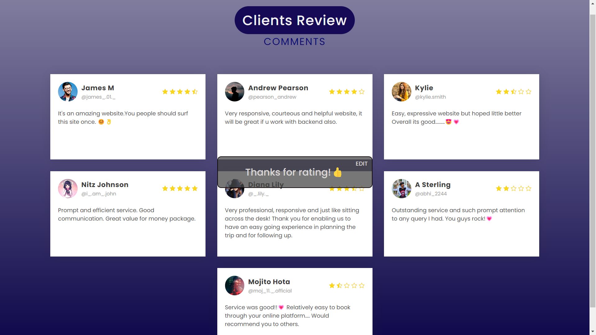

<p  align="right">

# Travel Website - Front-End Development
# Hie, I'm Ipsita! 👋
📌 Ping me on [LinkedIn](https://www.linkedin.com/in/ipsita-das724/) for any Doubt Clearence
## Highlights
This Project is all about multi-page responsive frontend website development
    
## Run Locally

1. Download this project

    or

    You can clone it to your Github Account by executing the code below in your system terminal. (Ignore this step, If you have already downloaded)
```bash
https://github.com/Ipsita15/TravelSite-main.git
```

💬 Ask me, If your project is not running - 
[Linkedin](https://www.linkedin.com/in/ipsita-das724/)
## 🚀 About Me
I'm an Engineering Student & A Full Stack Web Developer


## 🛠 Skills Required for this Project...
HTML, CSS & JavaScript only...

## Tools Required
- [Visual Studio Code](https://code.visualstudio.com/download)
- [Live Server](https://marketplace.visualstudio.com/items?itemName=ritwickdey.LiveServer)
- [Chrome](https://www.google.com/chrome/thank-you.html?brand=JJTC&statcb=1&installdataindex=empty&defaultbrowser=0#)


## Screenshots ||  Multi-Page

### First Page


-

### Mid Page


-

-
 ### Review Page


-

-
### Contact Page


-
### Gallery Page


-  

-  
## Feedback

If you have any feedback, please reach out to us at ipsitad15@gmail.com
